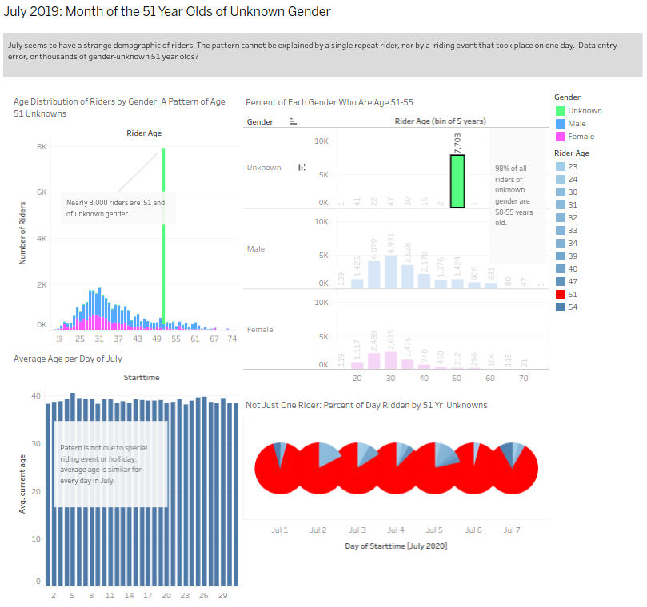

## Summary:

This Tableau-based analysis of data from CitiBykeNYC on the use of the citibike rental service reveals a strange anomoly. The data seems to show that during the month of July, 2020, an unrealistic proportion of riders were 51 and of unknown gender. These rentals occurred at different times of day on many days of the month, and were too frequent to be attributed to one very active rider. A data entry error is suspected.

## The Files:
```
|+-- data
|   +--201906-citibike-tripdata.csv -> Bike data from June, 2019
|   +--JC-202007-citibike-tripdata.csv -> Bike data from July, 2020
|+--images
|   +--gender_unknowns.png 
|   +--puzzle_many51unknowns.png
```

## Dashoard:

 

